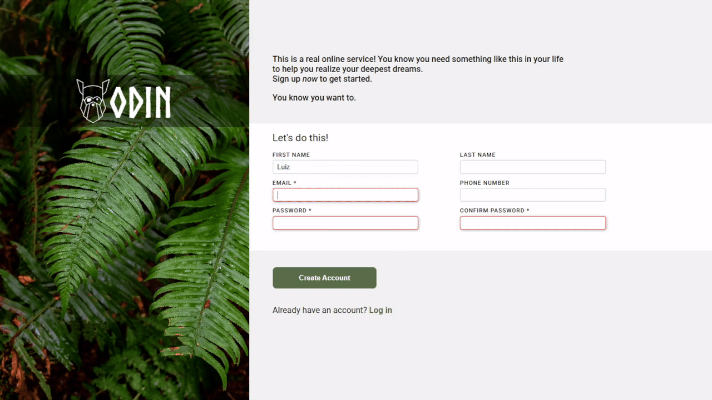

# Odin Project - Sign Up Form

This is a project made to the [Odin Project Intermediate HTML and CSS Course](https://www.theodinproject.com/lessons/node-path-intermediate-html-and-css-sign-up-form). Status: Completed.

## Screenshot

## About

This is a sign up form page. Made to practice how structure and style a HTML form. I used just HTML and CSS for this project.

## Links

- Live Site URL: [Github Pages](https://luizhen527.github.io/sign-up-form/)

<!-- - [Example resource 1](https://www.example.com) - This helped me for XYZ reason. I really liked this pattern and will use it going forward.
- [Example resource 2](https://www.example.com) - This is an amazing article which helped me finally understand XYZ. I'd recommend it to anyone still learning this concept. -->

## Coded by

- Linkedin - [@luizhen765](https://www.linkedin.com/in/luizhen765/)